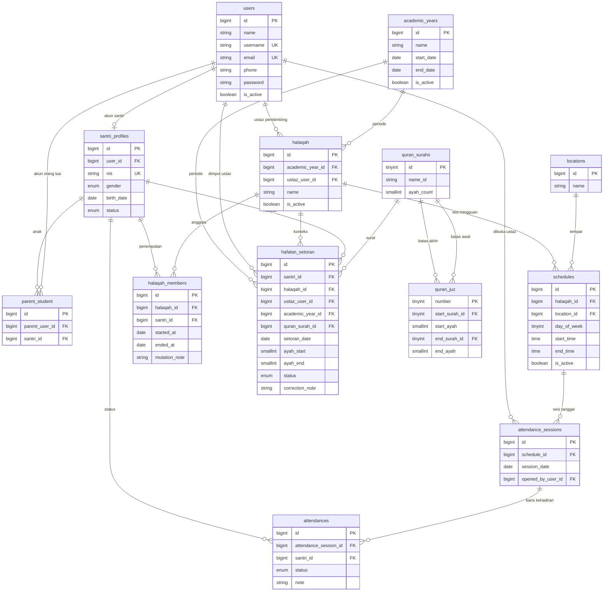

# ERD — KP_SDS

Skema mengikuti 6 keputusan domain di `BLUEPRINT.md`. Nama tabel = calon model Laravel.

## Diagram relasi

Role Spatie (`roles`, `model_has_roles`) tidak digambar. Nilai role: `super_admin`, `ketua`, `ustaz`, `santri`, `orang_tua`. Satu user = satu role di MVP.

## Aturan data (ikut keputusan terkunci)

### Identitas

| Aturan | Implementasi |
| --- | --- |
| Super Admin tidak CRUD operasional | Seeder: 1 super admin + 1 ketua. Super Admin hanya kelola akun Ketua dan status sistem. |
| Ketua membuat akun Ustaz, Santri, Orang Tua | Form Ketua mengisi `users` + assign role. Santri otomatis dapat `santri_profiles`. |
| Login santri memakai NIS | `users.username` = NIS untuk role santri. Email boleh kosong. |
| Orang tua taut anak lewat NIS | Insert `parent_student` setelah NIS ditemukan. Satu orang tua banyak anak; satu anak boleh banyak orang tua (ayah + ibu). |
| `santri_profiles.status` | `aktif`, `lulus`, `keluar`. Hanya `aktif` yang bisa masuk halaqah. |

### Halaqah

| Aturan | Implementasi |
| --- | --- |
| Satu halaqah aktif per santri per tahun ajaran | Unique parsial: kolom generated `active_slot` = 1 jika `ended_at` IS NULL, else NULL; unique `(santri_id, academic_year_id, active_slot)`. `academic_year_id` didenormalisasi di `halaqah_members` (disalin dari halaqah saat insert) agar index tidak bergantung join. |
| Mutasi | Set `ended_at` + `mutation_note` pada baris lama, insert baris baru ke halaqah tujuan. |
| Pembimbing | `halaqah.ustaz_user_id` wajib. Ganti ustaz = update FK, bukan role baru. |

### Jadwal & absensi

| Aturan | Implementasi |
| --- | --- |
| Jadwal berulang mingguan | `day_of_week` 1=Senin … 7=Minggu. Tidak generate baris per tanggal. |
| Sesi absensi | Ustaz membuka sesi dari slot yang `day_of_week` = hari ini. Unique `(schedule_id, session_date)`. |
| Daftar nama | Diambil dari `halaqah_members` yang `ended_at` null pada halaqah jadwal itu. |
| Status | enum `hadir`, `izin`, `sakit`, `alfa`. Semua anggota harus punya baris saat sesi disimpan. |
| Siapa boleh absen | Policy: ustaz pembimbing halaqah itu, atau Ketua. Tidak ada ustaz pengganti di MVP. |

### Hafalan

| Aturan | Implementasi |
| --- | --- |
| Validasi ayat | `1 ≤ ayah_start ≤ ayah_end ≤ quran_surahs.ayah_count`. |
| Status | `lancar`, `ulang`, `perbaikan`. |
| Histori vs progress | Semua status tersimpan. Progress juz **hanya** baris `lancar`. |
| Tumpang tindih ayat | Diizinkan (murajaah). Progress memakai **union ayat unik** berstatus `lancar`, bukan jumlah baris. |
| Urutan surat | Tidak wajib berurutan. |
| Koreksi | Ustaz/Ketua boleh edit baris; isi `correction_note`. Tidak ada tabel audit terpisah di MVP. |
| Konteks | `halaqah_id` + `academic_year_id` mencatat di kelompok mana setoran terjadi. |

### Progress juz (hitung saat baca)

Tidak ada tabel agregat.

1. Ambil semua `hafalan_setoran` santri dengan `status = lancar` (filter tahun ajaran aktif).
2. Expand setiap rentang `(surah, ayah_start..ayah_end)` menjadi himpunan ayat.
3. Union-kan (ayat yang sama dihitung sekali).
4. Iris dengan peta `quran_juz` (30 rentang mushaf Utsmani/Madinah, di-seed).
5. Persen juz *n* = ayat unik lancar di juz *n* / jumlah ayat juz *n*.
6. Persen total = ayat unik lancar / 6236.

Query bisa di-cache request-level (sekali per page load). Index: `(santri_id, academic_year_id, status)`.

## Constraint & index penting

- `users.username` unique; `users.email` unique nullable
- `santri_profiles.user_id` unique; `santri_profiles.nis` unique
- `parent_student (parent_user_id, santri_id)` unique
- `academic_years`: paling banyak satu baris `is_active = 1` (dicek di aplikasi / trigger)
- `halaqah_members`: unique aktif per `(santri_id, academic_year_id)` seperti di atas
- `schedules`: cegah bentrok ustaz di jam yang sama lewat validasi aplikasi (bukan unique DB)
- `attendance_sessions (schedule_id, session_date)` unique
- `attendances (attendance_session_id, santri_id)` unique
- `hafalan_setoran`: index `(santri_id, academic_year_id, status)`

## Yang sengaja tidak ada di ERD MVP

- Multi-pesantren / tenant
- Ustaz pengganti per sesi
- Queue/job progress
- Notifikasi WhatsApp
- Tabel audit penuh
- Cache tabel `progress_juz`
